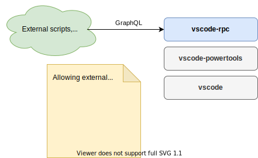
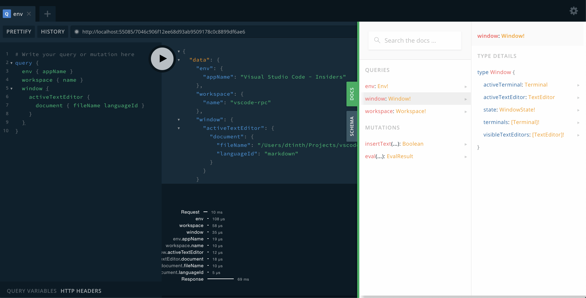
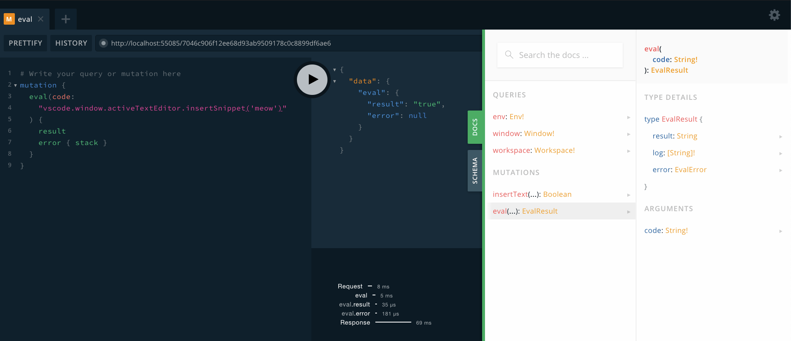

# vscode-rpc

A [VS Code Power Tools](https://marketplace.visualstudio.com/items?itemName=ego-digital.vscode-powertools) [Command](https://github.com/egodigital/vscode-powertools/wiki/Commands) that exposes an API to allow programmatic access to current VS Code window.

<a href="https://app.diagrams.net/?src=about#Hdtinth%2Fvscode-rpc%2Fmaster%2Fdocs%2Fimages%2Fecosystem.svg">
  
</a>

## Query VSCode’s state using GraphQL



## Evaluate arbitrary JavaScript



## Setup

To clone the project:

```sh
git clone https://github.com/dtinth/vscode-rpc.git
cd vscode-rpc
yarn
```

Then, add the command in VS Code’s `settings.json`:

```json
{
  "ego.power-tools": {
    "commands": {
      "toggleRPC": {
        "script": "/<path/to>/vscode-rpc/command.js",
        "button": { "text": "RPC" }
      }
    }
  }
}
```

This will add the button “RPC” to the status bar.

When clicked, it will start a GraphQL server. This script uses a rudimentary **pathname authentication** — the port and pathname will be randomized, e.g. `http://localhost:55085/7046c906f12ee68d93ab9509178c0c8899df6ae6`.

You can copy the URL by clicking the **“Copy URL”** button that appears, or click the **“Open”** button to open in your default browser directly.
Once you go to that URL, you’ll see a GraphQL Playground.
